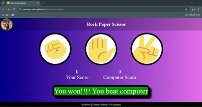

## Rock Paper Scissor (Visually Interactive)

<p align="center">
  
</p>

A visually interactive and dynamic Rock-Paper-Scissors game where the user plays against a computer opponent. Browser based game.

## Features:

- Incorporates Modular programming while writing scripts.
- Visually clear, and dynamic in nature.
- Shows live leaderboard score on UI.
- Used box-shadow, and linear-gradient like concepts.
- Plays against computer that makes random choices.

## Technologies:

Three Musketeers: HTML, CSS, JavaScript

## Hosted on Github:

URL Link:

    https://tanmay-create.github.io/Rock_Scissor_Paper/

## Set-Up:

Clone the Repo on your local Computer:

```bash
git clone https://github.com/Tanmay-create/Rock_Scissor_Paper.git

 